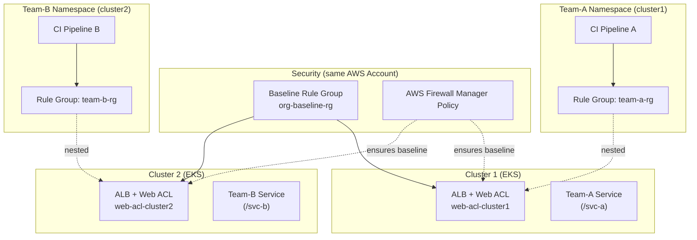
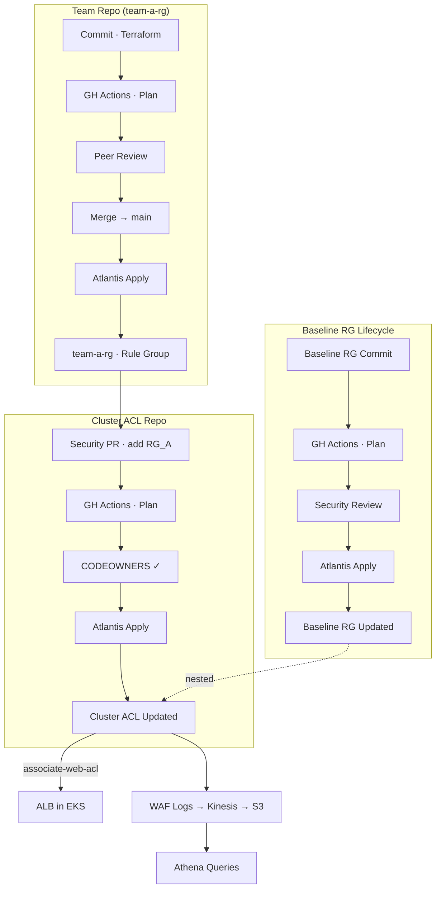

# AWS WAF Multi-Team Ruleset Roll-out — Technical Implementation Plan
*Version 1.0  |  Target Audience: Principal Security Architect, Director Security Engineering & Infrastructure*

---

## 0  Executive Summary
Our organisation operates **shared EKS clusters** where many product teams deploy micro-services behind a **single Application Load Balancer (ALB)**. We must:
1. Let **Security** own and enforce a non-removable **baseline Web ACL ruleset** (OWASP Top 10, bot mitigation, etc.).
2. Allow **each team** to add, version, and tune **service-specific rules** (rate-limits, allow-lists) that apply **only** to their host/path without affecting other teams.
3. Deliver the solution in a *governable, auditable, and cost-effective* way using AWS-native features, IaC, and CI pipelines.

We will implement a **Per-Cluster Web ACL + Scoped Rules** pattern powered by:
* AWS WAF v2 *nested rule groups* + *scope-down statements* or *LabelMatchStatement*.
* AWS Firewall Manager to guarantee the baseline rule group is always present.
* Service-Control Policies (SCP) and least-privilege IAM roles to separate duties.
* Terraform modules and GitHub Actions pipelines for repeatable provisioning.

Outcome: Security retains full control of baseline protection while teams gain controlled autonomy, with zero cross-service blast-radius.

---

## 0A  Edge WAF Variant — Akamai
Although this plan focuses on AWS WAF, the same "baseline + team-specific rules" model can be realised with **Akamai App & API Protector / Kona Site Defender** running at the CDN edge.

Key implementation differences (high-level):

| Area | AWS WAF (current plan) | Akamai Edge WAF |
|------|------------------------|-----------------|
| Enforcement Point | Regional, attached to ALB | Globally distributed Akamai POPs before traffic reaches AWS |
| Baseline | `org-baseline-rg` nested into every Web ACL | Shared *Security Configuration* rules locked by Security team |
| Team Rules | Nested rule groups scoped to host/path | Per-Hostname / Match-Target overrides or separate child configs |
| IaC Provider | `terraform-aws-wafv2` | `akamai/appsec` Terraform provider or Akamai Pipeline CLI |
| CI/CD Flow | Plan → Atlantis apply → `associate-web-acl` | Plan → create config version → Activate **STAGING** → test → Activate **PRODUCTION** |
| Guard-Rails | AWS Firewall Manager + SCP | Akamai RBAC (read-only baseline sections) + CI policy linting |
| Logs & Metrics | WAF logs → Kinesis/S3 → Athena | SIEM Data Feeds / Cloud Monitor → S3/Splunk |
| Latency Impact | ~1 ms inside AWS region | ~1 ms at edge; reduces origin bandwidth |
| Activation Time | Instant (< 1 s) | 5-15 minutes (edge propagation) |

High-level steps to adopt Akamai instead:
1. **Create Baseline Security Config** – Security owns, includes OWASP & bot rules. Activate to all hostnames.
2. **Define Match Targets per Team** – one per service host/path; grant teams *editor* rights only for their targets.
3. **CI/CD** – Replace AWS provider with Akamai provider; pipelines version & activate configs through STAGING → PRODUCTION gates.
4. **Logging** – Enable SIEM feed → push to existing S3 bucket; update Athena/Grafana dashboards.
5. **Rollback / Fail-Open** – Keep origin ALB security groups strict; optionally CNAME to fallback DNS that bypasses WAF only under incident SOP.

This option preserves the same governance & workflow structure while moving inspection to the CDN edge and reducing per-cluster AWS object count.

---

## 1  Current Environment Overview
| Component | Current State |
|-----------|---------------|
| AWS Account | **Single** production account hosting all clusters and ALB resources. |
| EKS Clusters | 3 (Prod / Staging / Dev) — each hosts 20-60 Kubernetes namespaces, operated by multiple product teams. |
| Ingress | Single **AWS Load Balancer Controller** (v2.6) per cluster; one **ALB** (`shared-alb`) per cluster. |
| WAF | **None** (no WAF currently deployed). |
| CI/CD | GitHub Actions runners; Terraform deployed via Atlantis. |
| Org Controls | AWS Organizations SCPs applied at account, but no WAF policies yet. |

---

## 2  Target End-State Architecture



Key points:
* **Single ALB & Web ACL** for cluster → cost-efficient.
* **Baseline** is rule priority 0 and immutable.
* **Team rule groups** are nested with *scope-down* to host/path or WAF labels.
* **Firewall Manager** auto-remediates if baseline removed.

---

## 3  Technical Requirements
### 3.1 AWS
1. Single AWS account with WAF v2 (`REGIONAL`) enabled in each cluster region.
2. AWS Firewall Manager (delegated administrator **can be the same account**).  
   *Note: Because baseline and team rule groups live in the same account, cross-account nested rule-group permissions are unnecessary.*
3. Quota increases: ≥ 200 rules / Web ACL; ≥ 1 000 labels / account.

### 3.2 Kubernetes
1. AWS Load Balancer Controller **v2.6+** (supports WAF labels via `waf.exclusions`).
2. Namespace per team; RBAC restricting edits to their `Ingress` objects.

### 3.3 Tooling & IaC
1. Terraform v1.5+ with `terraform-aws-modules/wafv2` module.
2. Central GitHub repo `security/waf-baseline` (baseline RG **and** cluster ACL definitions).  
   *The repo can host **multiple Terraform projects**, one per cluster, or you may split into per-cluster repos. See 3.4.*
3. Per-team repos containing service rule groups & `Ingress` manifests.

### 3.4 Repository Strategy — Single vs. Many
| Model | Description | Pros | Cons |
|-------|-------------|------|------|
| **Single repo, multi-cluster directories** | One repo (`security/waf-baseline`) with:<br/>• `/baseline/` – baseline RG Terraform<br/>• `/clusters/cluster-name/` – a stack that calls the reusable `cluster_acl` module.<br/>Each directory is a separate Terraform *workspace*/state. | • One source of truth<br/>• Shared modules & pipeline<br/>• Easy cross-cluster audits | • Larger repo; concurrent plans queue in Atlantis/TFC.<br/>• Mis-merge *could* touch many clusters (mitigated by CODEOWNERS per folder). |
| **One repo per cluster** | `security/waf-acl-cluster1`, `security/waf-acl-cluster2`, … each containing the stack for exactly one Web ACL. | • Blast-radius limited to one cluster<br/>• Simpler history per repo | • Multiple repos to maintain<br/>• Need to replicate branch-protection & CI config |

#### Example Single-Repo Layout
```
security/waf-baseline/
├── baseline/
│   └── baseline_rg.tf
├── clusters/
│   ├── prod-us-east-1/
│   │   └── main.tf
│   ├── prod-eu-west-1/
│   │   └── main.tf
│   └── staging-us-east-1/
│       └── main.tf
└── modules/
    └── cluster_acl/
        └── main.tf
```

#### Atlantis Configuration (single repo)
```yaml
# atlantis.yaml
version: 3
projects:
  - name: prod-us-east-1
    dir: clusters/prod-us-east-1
    workspace: prod-us-east-1
  - name: prod-eu-west-1
    dir: clusters/prod-eu-west-1
    workspace: prod-eu-west-1
  - name: staging-us-east-1
    dir: clusters/staging-us-east-1
    workspace: staging-us-east-1
```

> Regardless of repo model, each cluster's ACL code is isolated in its own Terraform **state**; changes to Cluster A cannot overwrite Cluster B.

---

## 4  Implementation Phases
### Phase 0: Preparation (Week 0-1)
* Raise AWS quotas; enable Firewall Manager.
* Draft baseline rules; security review & threat-model.
* Communicate rollout timeline to engineering org.

### Phase 1: Infrastructure Bootstrap (Week 2)
| Task | Owner | Deliverable |
|------|-------|-------------|
| Create `org-baseline-rg` in Security account | Sec Eng | Rule Group ARN exported via SSM. |
| Provision `cluster-web-acl` (Terraform) with baseline nested | Sec Eng | Web ACL ARN. |
| Attach Web ACL to ALB via AWS CLI (`associate-web-acl`) | Sec Eng | ALB secured with baseline only. |
| Deploy Firewall Manager Policy (`MANDATORY` type) | SecOps | Auto-remediation enabled. |

### Phase 2: Team On-Boarding (Rolling, Week 3-6)
1. Team forks Terraform **rule-group template**.
2. Pipeline validates JSON rules via `cfn_nag` and `wafv2 validate-web-acl`.
3. Merge → CI applies Rule Group → outputs ARN.
4. Security PR adds nested rule-group block *and scope-down statement* to cluster ACL repo:
```hcl
rule {
  name     = "team-a-rules"
  priority = 20
  statement {
    rule_group_reference_statement { arn = module.team_a_rg.arn }
  }
  visibility_config { sampled_requests_enabled = true, cloudwatch_metrics_enabled = true, metric_name = "teamA" }
}
```
5. Terraform plan shows delta; after approval, Atlantis applies.

### Phase 3: Validation & Cut-over (Week 4-8)
* All team rules start in **Count** mode for 7 days.
* Sec Eng & team review `SampledRequests` + ALB logs in Athena.
* Flip to **Block** once false-positives ≤ 0.1%.

### Phase 4: Operations & Maintenance (Ongoing)
* Quarterly baseline rule review vs. OWASP update.
* Auto-PR bot alerts if a team rule-group capacity > 500 WCUs.
* CloudWatch composite alarms: `BlockedRequests > THRESHOLD && 5xx > baseline`.

---

## 5  CI/CD Reference Pipelines
### 5.1 Baseline Repo (`security/waf-baseline`)
* GitHub Actions workflow `apply.yml`
  1. `terraform fmt && tflint`
  2. `terraform plan` — requires 2 code-owners.
  3. `terraform apply` on `main` branch.

### 5.2 Team Rule-Group Template (`teams/*/waf`)  
Reusable GitHub Actions file:
```yaml
name: WAF-RuleGroup-CI
on: [push]
jobs:
  build:
    runs-on: ubuntu-latest
    steps:
    - uses: actions/checkout@v4
    - name: Validate Rules
      run: |
        pip install checkov
        checkov -d .
    - name: Terraform Apply (team role)
      uses: hashicorp/setup-terraform@v2
      with:
        terraform_version: 1.5.7
    - run: terraform init
    - run: terraform plan -no-color
    - run: terraform apply -auto-approve
      env:
        AWS_ROLE_ARN: ${{ secrets.TEAM_WAF_ROLE }}
```

### 5.3 End-to-End CI/CD Flow – Ruleset Lifecycle
The diagram below illustrates how both security and engineering teams iterate on WAF rules, how Terraform/Atlantis promotes changes, and how updates land on the running ALB.



---

## 6  Governance & RBAC
| Aspect | Mechanism |
|--------|-----------|
| Baseline immutability | SCP denies `wafv2:DeleteRuleGroup` + Firewall Manager policy. |
| Team autonomy | Per-team IAM role `waf-TeamX-Editor` allows `CreateRuleGroup` **only** on ARNs matching `team-x-*` **within the same account**. |
| Code review | GitHub CODEOWNERS ensures Security approves baseline or priority < 10 changes. |
| Audit trail | CloudTrail + Security Lake; Athena queries join WAF & ALB logs. |

---

## 7  Monitoring & Incident Response
* **Real-time metrics** — CloudWatch Namespace `AWS/WAFV2`, per-rule metric names.
* **Log aggregation** — WAF logs → Kinesis Firehose → S3 → Glue catalog.
* **Dashboards** — Grafana panels: baseline vs. custom block counts; 4xx/5xx correlation.
* **Playbooks** — If surge in `svc-a-rate-limit` blocks, page Team-A on PagerDuty.

---

## 8  Risks & Mitigations
| Risk | Likelihood | Impact | Mitigation |
|------|-----------|--------|-----------|
| Rule limit reached (2 000) | Medium | Teams blocked from adding rules | Quarterly capacity report, prune stale rules, split ACL if > 1 500 rules. |
| Teams bypass baseline via mis-scoped statements | Low | Security gap | Mandatory nested baseline + automated unit test validating ACL JSON. |
| Latency spike from complex regex | Low | P99 HTTP latency | Pipeline regex complexity linter; WAF monitoring. |

---

## 9  Appendices
### 9.1 AWS Quotas (after requested increases)
| Item | New Limit |
|------|-----------|
| ALBs / region / account | 400 |
| Web ACLs / account | 250 |
| Rules / Web ACL | 2 000 |
| WCUs / Web ACL | 10 000 |

### 9.2 Glossary
* **Web ACL** — Web Access Control List.
* **Rule Group** — Reusable set of rules that can be nested inside a Web ACL.
* **WAF Label** — Metadata tag added during evaluation; can trigger subsequent rules.

---

## 10  Useful Links
* AWS WAF Developer Guide: <https://docs.aws.amazon.com/waf/latest/developerguide/>
* AWS Firewall Manager: <https://docs.aws.amazon.com/firewall-manager/latest/devguide/>
* AWS Load Balancer Controller docs: <https://kubernetes-sigs.github.io/aws-load-balancer-controller/latest/>
* Terraform AWS WAFv2 module: <https://github.com/terraform-aws-modules/terraform-aws-wafv2>
* Example repo (multi-app ACL): <https://github.com/terraform-aws-modules/terraform-aws-wafv2/tree/master/examples/single-acl-multi-site> 