```mermaid
graph TD
  subgraph "Security Acct"
    BASE[Baseline Rule Group ▾ org-baseline-rg]
  end
  subgraph "App Acct / EKS Cluster"
    INGRESS[Ingress YAML] -->|creates| ALB[ALB<br/>service-a.example.com]
    RG[Team Rule Group ▾ svc-a-custom-rg]
    ACL[Web ACL ▾ svc-a-web-acl]
  end
  BASE --> ACL
  RG   --> ACL
  ACL -. attaches .-> ALB
```

```mermaid
graph TD
  subgraph "Security Acct"
    BASE[Baseline Rule Group ▾ org-baseline-rg]
  end
  subgraph "EKS Cluster"
    ALB[Shared ALB + Web ACL\ncluster-web-acl]
    SVC1[Service A]
    SVC2[Service B]
  end
  BASE --> ALB
  ALB -->|"/svc-a"| SVC1
  ALB -->|"/svc-b"| SVC2
```

# Rolling Out AWS WAF in Shared Kubernetes Clusters

*Version 1.0 – DRAFT*

---

## 📜 Goal & Context
Many engineering teams run multiple micro-services in the **same Kubernetes cluster**. We want:

1. **Security Platform** maintains a *baseline* Web ACL (rule groups covering OWASP Top 10, bot mitigation, etc.).
2. **Product teams** own additional service-specific WAF rules (tuning false-positives, adding allow-lists, etc.).
3. No team can delete or modify the baseline rules, yet onboarding a new service WAF should take < 30 min.

> **Is this feasible?** Yes—AWS WAFv2, AWS Firewall Manager, and the AWS Load Balancer Controller provide the primitives to achieve this decoupled ownership model.

---

## 1 🔧 Reference Architecture

```mermaid
graph TD
  subgraph Security Account
    A1[Baseline Rule Group<br/>"org-baseline-rg"]
    A2[Security Terraform Pipeline]
  end

  subgraph Shared EKS Cluster
    B1[ALB Ingress<br/>"service-a.example.com"]
    B2[ALB Ingress<br/>"service-b.example.com"]
  end

  subgraph App Accounts (delegated)
    C1[Team A Rule Group<br/>"svc-a-custom-rg"]
    C2[Team B Rule Group<br/>"svc-b-custom-rg"]
  end

  A1 -->|nested| C1
  A1 -->|nested| C2
  C1 -->|associate| B1
  C2 -->|associate| B2
  classDef baseline fill:#ffefd5,stroke:#f2b200;
  class A1 baseline;
```

Key points:
* **Baseline Rule Group** lives in a *central security account*; teams reference it as a *read-only nested rule*.
* Each **ALB Ingress** gets its own Web ACL (AWS WAFv2) composed of:
  1. `org-baseline-rg` (immutable)
  2. `team-custom-rg` (optional, managed by service team)
* AWS **Load Balancer Controller** binds the Web ACL to the ALB via annotations.
* AWS **Firewall Manager** (optional) can enforce association of the baseline rule group and prevent detachment.

---

## 2 🏗️ Implementation Patterns

### 2.1 Per-Ingress Web ACL (Recommended)
* Each `Ingress` object results in one Application Load Balancer (ALB).
* Teams deploy a Web ACL per ALB using Terraform/CloudFormation or the AWS Load Balancer Controller annotations.
* Security supplies the baseline rule group ARN that **must** be nested into every Web ACL.

Pros:
* Clear logical boundary—team can tweak only their own ACL without impacting neighbours.
* Works in multi-tenant clusters (namespaces ≠ AWS accounts).

Cons:
* Extra Web ACL per service → slight additional cost (~US$5 / ACL / month).

#### Deep Dive

##### 0 • Why You'd Even Care
In a shared Kubernetes cluster, dozens of micro-services live side-by-side. Each service is fronted by its own HTTPS load balancer (ALB). The security team wants a **non-removable baseline ruleset** (OWASP Top-10, bot mitigation, etc.), yet product teams need freedom to add service-specific rules. The *Per-Ingress Web ACL* pattern gives **hard multi-tenancy at the WAF layer** while letting teams iterate safely.

##### 1 • AWS Primitives Involved
1. **Application Load Balancer (ALB)** – layer-7 proxy; each attaches to exactly **one** Web ACL.
2. **AWS WAF v2** – Web ACL container; supports **nested rule groups** (read-only embeds) for baseline.
3. **AWS Load Balancer Controller** – Kubernetes controller that watches `Ingress` objects and materialises ALBs & Target Groups; exposes Web-ACL annotation.
4. **AWS Firewall Manager** *(optional)* – Organisation-wide policy to enforce presence of the baseline rule group.
5. **IAM / SCP** – Deny deletion of baseline rule group; least-privilege roles for CI pipelines.

##### 2 • Kubernetes Primitives
1. **Ingress** – declarative HTTP route (host/path → service).
2. **Namespace isolation** – teams often get a namespace per service; cluster remains shared.

##### 3 • End-to-End Flow
1. **Baseline creation** (Security account) – Terraform publishes `org-baseline-rg` ARN.
2. **Service pipeline** –
   * Create custom rule group.
   * Create Web ACL nesting baseline + custom.
   * Annotate `Ingress` with Web-ACL ARN.
3. **Controller** creates the ALB and attaches the Web ACL.
4. **Runtime** – baseline rules evaluated first, then custom rules, before traffic hits pods.

```hcl
# ——— baseline (security account)
module "baseline_rg" {
  source   = "terraform-aws-modules/wafv2/aws//modules/rule-group"
  name     = "org-baseline-rg"
  capacity = 1500
  rules    = var.baseline_rules   # OWASP managed, etc.
}
```

##### 4 • Strengths
* **Isolation / blast-radius** – bad rule in service A never impacts service B.
* **Autonomy** – teams own their rules and deployment cadence.
* **Fine-grained metrics** – per-service CloudWatch namespace & sampled logs.
* **Incremental roll-out** – onboard one service at a time.

##### 5 • Trade-offs / Weaknesses
| Concern | Impact | Mitigation |
|---|---|---|
| Cost | ≈ US$5 / Web ACL / month + rule WCUs | EDP discount; turn off inspection for static assets |
| ALB & Web-ACL quotas | 100 default per region | Raise limits via AWS support |
| Resource sprawl | Hundreds of ALBs/WAF objects | Tagging standards & cleanup jobs |
| Latency overhead | WAF adds ~1 ms P99 | Acceptable for most web workloads |

##### 6 • Operational Considerations
* Enable **WAF full logs** → Firehose → S3 → Athena.
* Roll out in *Count* mode first; switch to *Block* after analysis.
* Version rule groups semantically (`svc-a-rg:1.2.0`).

##### 7 • Security Guard-Rails
* **SCP** denies `wafv2:DeleteRuleGroup` on baseline ARN except for security role.
* **Firewall Manager** policy enforces baseline rule group presence.
* CI roles lack permission to touch baseline rule group.

##### 8 • Hard Limits & Quotas *(AWS 2024-03)*
| Item | Default |
|---|---|
| Web ACLs / region / account | 100 |
| ALBs / region / account | 100 |
| Rule groups nested / ACL | 20 |

##### 9 • Performance & Scaling
Web ACL evaluation adds ~1 ms; ALB scales to >100 k req/s; WAF horizontally auto-scales.

##### 10 • When **NOT** to Use
* < 5 services (cost overhead).  
* Ultra-low-latency APIs (< 2 ms budget).  
* Hitting ALB quotas that cannot be increased.

##### 11 • Diagram


##### 12 • Key Take-aways
* Strong separation of concerns with minimal coordination.  
* Cost/quota management is the main drawback, but manageable.  
* Automation (Terraform) + governance (SCP, code-review) are critical.

###### Further Reading
* AWS WAF Developer Guide – Web ACL basics: <https://docs.aws.amazon.com/waf/latest/developerguide/web-acl.html>
* AWS Load Balancer Controller documentation: <https://kubernetes-sigs.github.io/aws-load-balancer-controller/latest/>
* Terraform AWS WAFv2 Module: <https://github.com/terraform-aws-modules/terraform-aws-wafv2>
* Nested Rule Groups (cross-account) announcement: <https://aws.amazon.com/about-aws/whats-new/2021/04/aws-waf-cross-account-rule-group-usage/>
* AWS Firewall Manager WAF Policy docs: <https://docs.aws.amazon.com/firewall-manager/latest/devguide/waf-policy.html>

### 2.2 Shared Web ACL at Cluster Ingress
* One ALB and one Web ACL front multiple services (path-based routing).
* Baseline + team-specific rules implemented via **rule priorities** or conditional rule logic (`"LabelMatchStatement"`).

Pros:
* Fewer AWS resources and simpler networking.

Cons:
* Policy coupling—teams must coordinate rule changes & priorities.
* Blast-radius: a bad rule can impact all services behind the ALB.

#### Deep Dive

##### 0 • Why You'd Even Care
You run a *small-to-medium* cluster where operational simplicity and cost trump strict isolation. A single ALB + Web ACL covers every service; onboarding a new route ≈ adding an `Ingress` path.

##### 1 • AWS Primitives Involved
1. **ALB** – one per cluster; handles host/path routing for all services.
2. **AWS WAF v2** – a *single* shared Web ACL.  
   *Baseline* rule group first, followed by *team* rule groups keyed on labels or priorities.
3. **AWS Load Balancer Controller** – still creates/updates ALB but **does not** manage multiple Web ACLs.
4. **Firewall Manager** – can enforce baseline rule group but has limited context of per-team overrides.

##### 2 • Kubernetes Primitives
* **Ingress** – multiple hosts/paths share the ALB.
* **IngressClass Parameters** – optional custom resource to point to the shared ALB & Web ACL.

##### 3 • End-to-End Flow
1. Security publishes `org-baseline-rg` and shared Web ACL (`cluster-web-acl`).
2. Teams only push `Ingress` objects; no need to create Web ACLs.
3. If a service needs extra rules, Security (or a delegated ops team) modifies the *shared* ACL: higher-priority rules or `LabelMatchStatement` selecting that path.

Example snippet (Service A rule inside shared ACL):
```jsonc
{
  "Name": "svc-a-rate-limit",
  "Priority": 20,
  "Statement": {
    "AndStatement": {
      "Statements": [
        { "LabelMatchStatement": { "Scope": "LABEL", "Key": "svc-a" } },
        { "RateBasedStatement": { "Limit": 2000, "AggregateKeyType": "IP" } }
      ]
    }
  },
  "Action": { "Block": {} }
}
```

##### 4 • Strengths
* **Cost-efficient** – one Web ACL (≈ US$5/month) regardless of service count.
* **Simplified ops** – fewer AWS objects to track; no per-service annotation mistakes.
* **Centralised visibility** – a single place to view logs & metrics.

##### 5 • Trade-offs / Weaknesses
| Concern | Impact | Mitigation |
|---|---|---|
| Blast-radius | Bad rule affects every service | Rigorous test pipeline, staged rollout |
| Coordination overhead | Teams share change window & priorities | Change-advisory board, rule namespaces |
| Rule limit | 2 000 entries per ACL | Use nested rule groups, prune stale rules |
| Metrics granularity | Harder to attribute to one service | Use `LabelMatchStatement` + log filters |

##### 6 • Operational Considerations
* **Change workflow** – Git repo for shared ACL JSON; merge requires approvals from affected teams.
* **Logging** – Enable label-based logging to distinguish traffic per service.
* **Staged rollout** – Use `CloudWatch Metric Filters` to simulate counts before blocking.

##### 7 • Security Guard-Rails
* Firewall Manager policy enforcing baseline rule group at *priority 0*.
* CI/CD pipeline lints rule JSON to deny deletion of baseline linkage.
* SCP denies deletion of shared Web ACL.

##### 8 • Hard Limits & Quotas
| Item | Default |
|---|---|
| Rules / Web ACL | 2 000 |
| Labels per request | 50 |
| Web ACLs / account | 100 |

##### 9 • Performance & Scaling
* Single ALB scales >100 k req/s but becomes a **shared SPOF**. Use *multi-AZ* and ALB *connection draining* during updates.
* WAF latency still ~1 ms; no additional cost per request as services grow.

##### 10 • When **NOT** to Use
* Organisations demanding **hard tenant isolation** at every layer.
* Clusters with **hundreds of services** surpassing rule limits.
* Teams with vastly different SLA / latency requirements.

##### 11 • Diagram


##### 12 • Key Take-aways
* Cheapest & simplest; excellent for small clusters.
* Requires strong governance to avoid rule conflicts.
* Logs & metrics need post-processing for per-service insight.

###### Further Reading
* AWS WAF Label Match Statement docs: <https://docs.aws.amazon.com/waf/latest/developerguide/waf-label-match-statement.html>
* Pattern for Shared ALB with Kubernetes (AWS LB Controller): <https://aws.amazon.com/blogs/opensource/build-shared-alb-amazon-eks/>
* Web ACL quotas & pricing: <https://aws.amazon.com/waf/pricing/>
* Terraform guide – single Web ACL multi-app: <https://github.com/terraform-aws-modules/terraform-aws-wafv2/tree/master/examples/single-acl-multi-site>

### 2.3 📂 Multi-Team Scenario — Distinct Rulesets on a Shared Cluster
Even with two (or more) teams deploying services to the **same EKS cluster**, you can still give each application its own WAF logic while preserving the *baseline* security rules. There are two architectural choices:

| Option | How It Works | Independence | Cost / Quota Impact |
|--------|--------------|--------------|---------------------|
| **A. Per-Ingress Web ACL** | Each `Ingress` references a *different* Web ACL that nests the baseline + the team's custom rule group. | 🔒 Highest – teams change only their own ACL. | 🏷️ One Web ACL per service (~US$5/ACL/month) and consumes Web-ACL/ALB quotas. |
| **B. Shared Web ACL with Scoped Rules** | One Web ACL attached to the ALB; team-specific rules are scoped by *host/path* or *WAF labels*. | ⚖️ Moderate – teams must submit PRs to the shared ACL repo. | 💸 Cheapest – single Web ACL; risk of rule conflicts. |

Below are code fragments for Option B — *host/path scope-down* and *label matching*. Use whichever best fits your routing strategy.

#### Host / Path Scope-Down Example
```hcl
# Team-A rate-limit rule applies only to app-a.example.com
rule {
  name     = "team-a-rules"
  priority = 20

  statement {
    rule_group_reference_statement {
      arn = module.team_a_rg.arn

      scope_down_statement {
        byte_match_statement {
          field_to_match      { single_header { name = "host" } }
          positional_constraint = "EXACTLY"
          search_string         = "app-a.example.com"
          text_transformations  = [{ priority = 0, type = "NONE" }]
        }
      }
    }
  }
}
```

#### Label-Match Example (requires ALB controller ≥ v2.4)
```yaml
# Ingress for Team-A service adds a label; controller propagates to WAF
apiVersion: networking.k8s.io/v1
kind: Ingress
metadata:
  name: svc-a
  labels:
    waf.label/svc-a: "true"   # custom key
  annotations:
    alb.ingress.kubernetes.io/ingress-class: "alb-shared"
...
```
```jsonc
// Web ACL JSON – rule triggers only when label "svc-a" present
{
  "Name": "svc-a-label-block",
  "Priority": 25,
  "Statement": {
    "LabelMatchStatement": { "Scope": "LABEL", "Key": "svc-a" }
  },
  "Action": { "Block": {} }
}
```

#### Decision Tips
* **Velocity first?** Choose *Per-Ingress*; teams release WAF changes on their own cadence.
* **Resource / cost sensitive?** Stay with a *Shared ACL* + scoped rules.
* **Security baseline must be immutable regardless of option.** Enforce with Nested-Rule-Group + Firewall Manager policy.

#### Additional References
* Scope-Down Statements: <https://docs.aws.amazon.com/waf/latest/developerguide/waf-rule-statements-scope-down.html>  
* AWS WAF Labels walkthrough: <https://aws.amazon.com/blogs/security/using-aws-waf-labels-for-advanced-traffic-filtering/>  
* GitHub example repo implementing both patterns: <https://github.com/awslabs/aws-waf-sample-apps>

---

## 3 📄 Example — Terraform Module

```hcl
module "web_acl_service_a" {
  source  = "terraform-aws-modules/wafv2/aws"  # community module

  name    = "svc-a-web-acl"
  scope   = "REGIONAL"

  default_action = "allow"

  # 1️⃣ Baseline (Security-owned)
  rule {
    name     = "org-baseline-nested"
    priority = 0
    override_action = "none"

    statement {
      rule_group_reference_statement {
        arn = var.baseline_rule_group_arn  # provided via TF remote state
      }
    }
  }

  # 2️⃣ Team custom rules
  dynamic "rule" {
    for_each = var.custom_rules
    content  = rule.value
  }
}

# Associate the Web ACL with the ALB created by the k8s Ingress
resource "aws_wafv2_web_acl_association" "alb_association" {
  resource_arn = data.aws_lb.service_a.arn
  web_acl_arn  = module.web_acl_service_a.arn
}
```

### Kubernetes Ingress Annotation
```yaml
apiVersion: networking.k8s.io/v1
kind: Ingress
metadata:
  name: service-a
  annotations:
    alb.ingress.kubernetes.io/load-balancer-type: "application"
    alb.ingress.kubernetes.io/wafv2-acl-arn: "arn:aws:wafv2:us-east-1:123456789012:regional/webacl/svc-a-web-acl/abc123"
    # optional: force HTTPS
    alb.ingress.kubernetes.io/listen-ports: '[{"HTTPS":443}]'
spec:
  ingressClassName: alb
  rules:
    - host: service-a.example.com
      http:
        paths:
          - path: /
            pathType: Prefix
            backend:
              service:
                name: service-a
                port:
                  number: 80
```

---

## 4 🔒 Guard-Rails & Governance

| Control | Implementation | AWS Feature |
|---------|----------------|-------------|
| Prevent deletion of baseline rule group | SCP denies `wafv2:DeleteRuleGroup` on baseline ARN except for security role | AWS Organizations SCP |
| Enforce baseline in every Web ACL | Firewall Manager Policy with mandatory rule group | AWS Firewall Manager |
| Peer review for `allow` or `override_action` changes | GitHub branch protection + PR template | native Git/GitHub |
| Time-boxed exceptions | `ttl_hours` variable in module. CI automatically deletes expired rules. | Terraform + Lambda CI |
| Central visibility | Security exports WAF logs to Splunk; Grafana dashboard shows block vs allow. | Kinesis Firehose, CloudWatch Logs |

---

## 5 📊 Observability
1. **ALB Access Logs** → S3 → Athena to measure WAF hit-counts vs. total traffic.
2. **WAF Metrics** → CloudWatch Namespace `AWS/WAFV2` (`BlockedRequests`, `AllowedRequests`).
3. **Synthetic Tests** → k6/Gauntlt pipeline triggers SQLi/XSS patterns verifying baseline still blocks.

---

## 6 🛣️ Migration Playbook

1. **Baseline Ready** — Security publishes `org-baseline-rg` and its version changelog.
2. **Education** — How-to guide & office hours for teams.
3. **Pilot** — Select 1–2 low-risk services per tribe. Enable in *count* (detect-only) mode for 7 days.
4. **Cut-over** — Switch to *block*; monitor error budgets.
5. **Broad Roll-out** — Enable WAF on remaining services via Terraform module & Ingress annotation.
6. **Continuous Improvement** — Quarterly efficacy review aligned with Wiz findings.

---

## 7 📚 Further Reading

* AWS docs: [AWS WAF Developer Guide](https://docs.aws.amazon.com/waf/latest/developerguide/)
* AWS Load Balancer Controller: [Ingress annotations](https://kubernetes-sigs.github.io/aws-load-balancer-controller/v2.6/guide/ingress/annotations/)
* Terraform AWS WAFv2 module example: <https://github.com/terraform-aws-modules/terraform-aws-wafv2>
* AWS Firewall Manager policy examples: <https://docs.aws.amazon.com/firewall-manager/latest/devguide/what-is-fms.html>
* Blog: *[Using AWS WAF with Amazon EKS clusters](https://aws.amazon.com/blogs/security/using-aws-waf-protects-amazon-eks/)*

---

## 8 ✅ Feasibility Summary
With AWS WAFv2 **nested rule groups**, **Firewall Manager**, and the **AWS Load Balancer Controller**, it is entirely feasible to let product teams own their Web ACLs while Security enforces a non-removable baseline. The pattern scales across hundreds of services, requires minimal central toil, and aligns with GitOps best practices. 