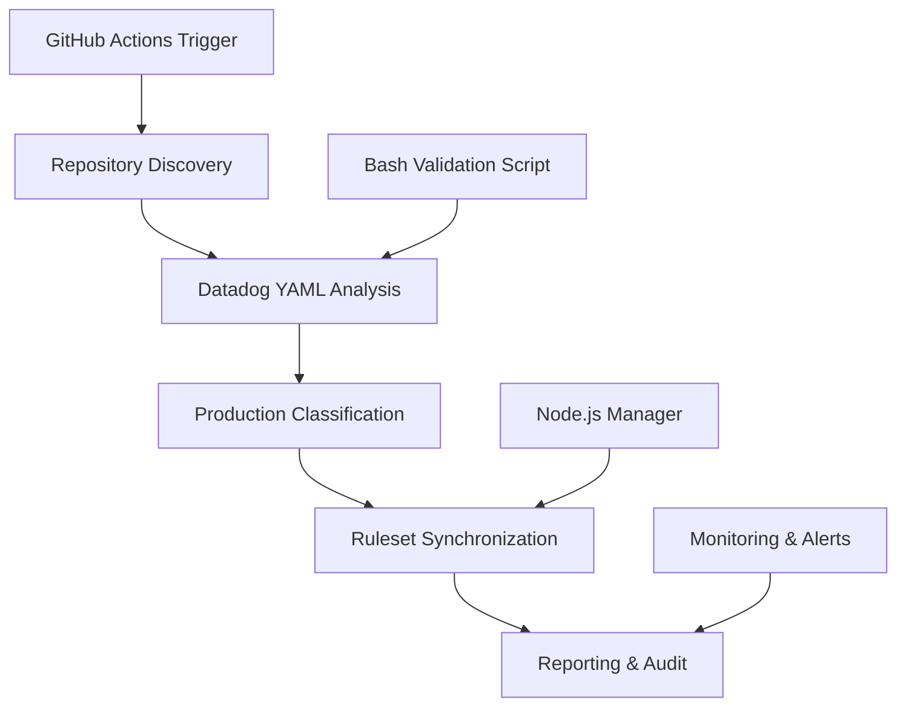

# Plus1 Enforcement System

## Overview

The Plus1 Enforcement system provides automated GitHub Enterprise repository ruleset management based on production lifecycle status defined in Datadog entity YAML files. This system ensures that production repositories are automatically included in governance controls while dynamically adapting to repository lifecycle changes.

## Key Features

- **🤖 Automated Governance**: Eliminates manual ruleset management overhead
- **🔄 Dynamic Adaptation**: Automatically adjusts to repository lifecycle changes  
- **✅ Compliance Assurance**: Ensures production repositories are always governed
- **📊 Comprehensive Reporting**: Provides detailed analysis and audit trails
- **🛡️ Security First**: Built with enterprise security and compliance in mind
- **⚡ High Performance**: Handles organizations with 1000+ repositories efficiently

## Quick Start

### Prerequisites

1. GitHub Enterprise organization with admin permissions
2. Personal access token with `repo`, `admin:org`, `read:org` scopes
3. Repositories with `entity.datadog.yaml` files (v3.0 schema)
4. Existing `plus1_enforcement` ruleset in your organization

### Installation

1. **Clone or download this repository structure**
   ```bash
   mkdir -p your-repo/plus1_enforcement
   # Copy all files from this plus1_enforcement directory
   ```

2. **Deploy the workflow**
   ```bash
   mkdir -p .github/workflows
   cp plus1_enforcement/docs/workflows/plus1-enforcement.yml .github/workflows/
   ```

3. **Configure GitHub Secrets**
   - Navigate to repository Settings → Secrets → Actions
   - Add `GHE_ADMIN_TOKEN` with your personal access token

4. **Test the system**
   ```bash
   # Manual trigger with dry run
   # Go to Actions tab and run "Plus1 Enforcement Ruleset Management" workflow
   # Set dry_run: true for initial testing
   ```

### Basic Usage

The system runs automatically every night at 4:00 AM UTC, but you can also trigger it manually:

- **Dry Run**: Test without making changes
- **Target Organization**: Specify different organization (defaults to current)
- **Manual Execution**: Trigger via GitHub Actions UI or API

## System Architecture



## Directory Structure

```
plus1_enforcement/
├── README.md                              # This file
├── docs/
│   ├── workflows/
│   │   └── plus1-enforcement.yml         # Main GitHub Actions workflow
│   └── workflow-documentation/
│       └── plus1-enforcement.md          # Comprehensive documentation
├── scripts/
│   ├── validate-datadog-yaml.sh          # Bash validation script
│   └── ruleset-manager.js                # Node.js management script
└── examples/
    └── entity.datadog.yaml               # Example Datadog YAML file
```

## Documentation

### 📖 Comprehensive Documentation
- **[Complete Implementation Guide](docs/workflow-documentation/plus1-enforcement.md)** - Full technical and business documentation (60+ pages)
  - Executive summary and business context
  - Technical architecture and implementation
  - Configuration reference and examples
  - Monitoring, troubleshooting, and maintenance
  - Security considerations and compliance mapping
  - Performance optimization and scalability

### 🛠️ Technical References
- **[GitHub Actions Workflow](docs/workflows/plus1-enforcement.yml)** - Production-ready workflow file
- **[Validation Script](scripts/validate-datadog-yaml.sh)** - Bash script for local testing
- **[Management Script](scripts/ruleset-manager.js)** - Node.js CLI tool for programmatic access

## Configuration

### Environment Variables

| Variable | Description | Default | Required |
|----------|-------------|---------|----------|
| `RULESET_NAME` | Target ruleset name | `plus1_enforcement` | Yes |
| `DATADOG_YAML_PATH` | Path to Datadog YAML file | `entity.datadog.yaml` | Yes |
| `PRODUCTION_LIFECYCLE_VALUES` | Production lifecycle values | `production,Production` | Yes |

### Datadog YAML Requirements

Your repositories must contain `entity.datadog.yaml` files with v3.0 schema:

```yaml
apiVersion: v3.0.1
kind: service
metadata:
  name: my-service
spec:
  lifecycle: production  # or 'Production'
  # ... other fields
```

## Usage Examples

### Manual Validation
```bash
# Validate a repository's Datadog YAML
./scripts/validate-datadog-yaml.sh --verbose /path/to/repository

# JSON output for automation
./scripts/validate-datadog-yaml.sh --json /path/to/repository > results.json
```

### Programmatic Management
```bash
# Dry run analysis
node scripts/ruleset-manager.js --org myorg --dry-run --verbose

# Full execution with reporting
node scripts/ruleset-manager.js --org myorg --output report.json
```

### Workflow Customization
```yaml
# Custom configuration in workflow
env:
  RULESET_NAME: 'custom_enforcement'
  DATADOG_YAML_PATH: 'config/entity.datadog.yaml'
  PRODUCTION_LIFECYCLE_VALUES: 'production,Production,prod'
```

## Monitoring and Reporting

### Key Metrics
- **Workflow Success Rate**: Target 99.5%
- **Processing Time**: Target < 10 minutes for 1000 repositories
- **Repository Coverage**: Target 100% of organization repositories
- **Ruleset Synchronization Accuracy**: Target 100%

### Daily Reports
The system generates comprehensive daily reports including:
- Repository analysis summary
- Production vs. non-production classification
- Ruleset changes applied
- Compliance status and trends
- Error analysis and recommendations

### Alerting
- Workflow failures trigger immediate notifications
- Performance degradation alerts
- Compliance drift monitoring
- Security event notifications

## Compliance Support

### Regulatory Standards
- **HITRUST CSF**: Control framework implementation (CC.6.1, CC.6.8)
- **FedRAMP**: Configuration management (CM-2, CM-3, CM-6)
- **HIPAA**: Administrative safeguards (164.308(a)(1))
- **SOC 2**: System monitoring and change management

### Audit Features
- Comprehensive audit trails (7-year retention)
- Change tracking with before/after states
- Performance metrics and trend analysis
- Automated compliance reporting

## Security

### Security Features
- Token-based authentication with minimal required scopes
- Input validation and safe YAML parsing
- Rate limiting and error handling
- Encrypted communication (TLS 1.3)
- Audit logging for all operations

### Access Control
- Role-based access to workflow triggers
- Read-only access to most repositories
- Write access only to designated rulesets
- Organization-scoped API operations

## Performance

### Scalability
- **Small Organizations** (< 100 repos): < 5 minutes
- **Medium Organizations** (100-1000 repos): < 15 minutes
- **Large Organizations** (1000+ repos): < 45 minutes

### Optimization Features
- Batch processing with configurable sizes
- Intelligent API rate limiting
- Parallel repository analysis
- Caching and conditional requests

## Troubleshooting

### Common Issues

1. **Rate Limit Errors**
   - Reduce `BATCH_SIZE` environment variable
   - Increase retry delays
   - Consider GitHub App authentication

2. **Schema Validation Failures**
   - Update Datadog YAML files to v3.0 schema
   - Adjust `PRODUCTION_LIFECYCLE_VALUES` configuration
   - Use validation script for debugging

3. **Ruleset Not Found**
   - Create `plus1_enforcement` ruleset manually
   - Verify token permissions (`admin:org`)
   - Check organization settings

### Debug Mode
```yaml
# Enable verbose logging
env:
  ACTIONS_RUNNER_DEBUG: true
```

## Contributing

### Development Setup
```bash
# Install dependencies for Node.js scripts
cd scripts
npm install @octokit/rest js-yaml

# Make bash scripts executable
chmod +x validate-datadog-yaml.sh
```

### Testing
```bash
# Test validation script
./scripts/validate-datadog-yaml.sh --help

# Test management script
node scripts/ruleset-manager.js --help

# Dry run full workflow
# Trigger manually with dry_run: true
```

## Support

### Documentation
- [📚 Complete Documentation](docs/workflow-documentation/plus1-enforcement.md) - Comprehensive implementation guide
- [🔧 Configuration Reference](docs/workflow-documentation/plus1-enforcement.md#configuration-reference) - All configuration options
- [🛠️ Troubleshooting Guide](docs/workflow-documentation/plus1-enforcement.md#monitoring-and-troubleshooting) - Common issues and solutions

### Getting Help
1. Check the comprehensive documentation for detailed guidance
2. Review workflow logs for specific error messages
3. Use dry-run mode to test changes safely
4. Validate individual repositories with the bash script

## License

This project is designed for enterprise GitHub environments and follows enterprise security and compliance standards.

## Version History

- **v1.0.0** - Initial release with core functionality
  - Automated ruleset management
  - Datadog YAML v3.0 schema support
  - Comprehensive reporting and monitoring
  - Enterprise security and compliance features

---

**🚀 Ready to automate your repository governance?** Start with the [Quick Start](#quick-start) guide above, then dive into the [complete documentation](docs/workflow-documentation/plus1-enforcement.md) for full implementation details. 