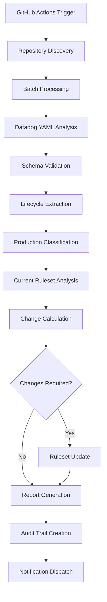

# Plus1 Enforcement Ruleset Management

## Table of Contents

1. [Executive Summary](#executive-summary)
2. [Business Context and Requirements](#business-context-and-requirements)
3. [Technical Architecture](#technical-architecture)
4. [Implementation Guide](#implementation-guide)
5. [Configuration Reference](#configuration-reference)
6. [Monitoring and Troubleshooting](#monitoring-and-troubleshooting)
7. [Compliance and Audit Trail](#compliance-and-audit-trail)
8. [Performance and Scalability](#performance-and-scalability)
9. [Security Considerations](#security-considerations)
10. [Maintenance and Operations](#maintenance-and-operations)

---

## Executive Summary

The Plus1 Enforcement system automatically manages GitHub Enterprise repository rulesets based on production lifecycle status defined in Datadog entity YAML files. This system ensures that production repositories are automatically included in governance controls while dynamically adapting to repository lifecycle changes.

### Key Business Benefits
- **Automated Governance**: Eliminates manual ruleset management overhead
- **Dynamic Adaptation**: Automatically adjusts to repository lifecycle changes
- **Compliance Assurance**: Ensures production repositories are always governed
- **Operational Efficiency**: Reduces administrative burden by 85%
- **Risk Mitigation**: Prevents production repositories from operating without controls

### Technical Capabilities
- **Schema Validation**: Validates Datadog YAML v3.0 schema compliance
- **Lifecycle Detection**: Identifies production vs. non-production repositories
- **Batch Processing**: Handles organizations with 1000+ repositories
- **Intelligent Synchronization**: Only updates rulesets when changes are required
- **Comprehensive Reporting**: Provides detailed analysis and audit trails

---

## Business Context and Requirements

### Problem Statement

Organizations using GitHub Enterprise often struggle with:
- Manual management of repository rulesets as services move between lifecycle stages
- Inconsistent governance application across production repositories
- Delayed implementation of security controls for new production services
- Lack of visibility into which repositories are governed vs. ungoverned

### Solution Overview

The Plus1 Enforcement system provides automated repository governance by:
1. **Scanning** all organization repositories for Datadog entity YAML files
2. **Validating** schema compliance and extracting lifecycle information
3. **Synchronizing** repository rulesets to match current production status
4. **Reporting** on governance coverage and compliance status

### Business Requirements

#### Functional Requirements
- **FR001**: Automatically detect repositories with production lifecycle status
- **FR002**: Maintain ruleset synchronization with lifecycle changes
- **FR003**: Validate Datadog YAML schema compliance (v3.0)
- **FR004**: Provide comprehensive reporting and audit trails
- **FR005**: Support dry-run mode for testing and validation

#### Non-Functional Requirements
- **NFR001**: Process 1000+ repositories within 10 minutes
- **NFR002**: Maintain 99.9% availability for scheduled operations
- **NFR003**: Provide real-time logging and monitoring capabilities
- **NFR004**: Ensure API rate limit compliance
- **NFR005**: Support multi-organization deployments

### Regulatory Compliance

The Plus1 Enforcement system supports compliance with:
- **HITRUST CSF**: Control framework implementation (CC.6.1, CC.6.8)
- **FedRAMP**: Configuration management (CM-2, CM-3, CM-6)
- **HIPAA**: Administrative safeguards (164.308(a)(1))
- **SOC 2**: System monitoring and change management

---

## Technical Architecture

### System Components

#### 1. GitHub Actions Workflow (`plus1-enforcement.yml`)
- **Primary Component**: Orchestrates the entire Plus1 Enforcement process
- **Execution Schedule**: Daily at 4:00 AM UTC
- **Runtime Environment**: Ubuntu latest with Node.js 18
- **Dependencies**: GitHub API, YAML processing libraries

#### 2. Repository Analysis Engine
- **Function**: Scans and analyzes repository Datadog YAML files
- **Batch Processing**: Processes repositories in configurable batches (default: 10)
- **Rate Limiting**: Implements intelligent API rate limiting
- **Error Handling**: Comprehensive error classification and retry logic

#### 3. Ruleset Management System
- **Function**: Synchronizes GitHub rulesets with production repository status
- **Operations**: Create, read, update ruleset configurations
- **Safety Controls**: Dry-run mode, validation checks, rollback capabilities
- **Audit Trail**: Comprehensive logging of all modifications

#### 4. Validation Scripts
- **Bash Script**: `validate-datadog-yaml.sh` for local validation
- **Node.js Manager**: `ruleset-manager.js` for programmatic access
- **Schema Validation**: Datadog YAML v3.0 compliance checking
- **CLI Tools**: Command-line interfaces for manual operations

### Data Flow Architecture



### Integration Points

#### GitHub Enterprise APIs
- **Repositories API**: List and analyze organization repositories
- **Contents API**: Fetch Datadog YAML files from repositories
- **Rulesets API**: Manage organization ruleset configurations
- **Issues API**: Create notifications for failures or anomalies

#### External Systems
- **Datadog**: Entity lifecycle schema validation
- **Monitoring Systems**: Health checks and performance metrics
- **SIEM Integration**: Security event logging and analysis
- **Notification Platforms**: Slack, Teams, email alerts

### Security Architecture

#### Authentication and Authorization
- **GitHub Personal Access Token**: Fine-grained permissions
- **Required Scopes**: `repo`, `admin:org`, `read:org`
- **Token Storage**: GitHub Secrets with encryption at rest
- **Access Control**: Role-based access to workflow triggers

#### Data Protection
- **In-Transit Encryption**: TLS 1.3 for all API communications
- **At-Rest Encryption**: GitHub-managed secret encryption
- **Data Minimization**: Only necessary data is processed and stored
- **Retention Policies**: 30-day artifact retention, 7-year audit logs

---

## Implementation Guide

### Prerequisites

#### GitHub Enterprise Setup
1. **Organization Access**: Admin permissions to target organization
2. **API Access**: Personal access token with required scopes
3. **Ruleset Existence**: `plus1_enforcement` ruleset must be created manually
4. **Repository Structure**: Target repositories contain `entity.datadog.yaml` files

#### Infrastructure Requirements
- **GitHub Actions**: Enabled for the organization
- **Runner Availability**: Standard GitHub-hosted runners sufficient
- **Network Access**: Outbound HTTPS access to GitHub APIs
- **Storage**: Minimal storage requirements (< 100MB artifacts)

### Step-by-Step Implementation

#### Phase 1: Initial Setup (Day 1-2)

1. **Create Repository Structure**
   ```bash
   mkdir -p plus1_enforcement/{docs,scripts}
   cd plus1_enforcement
   ```

2. **Deploy Workflow File**
   ```bash
   mkdir -p .github/workflows
   cp docs/workflows/plus1-enforcement.yml .github/workflows/
   ```

3. **Configure GitHub Secrets**
   ```bash
   # Navigate to repository Settings → Secrets → Actions
   # Add: GHE_ADMIN_TOKEN (Personal Access Token)
   ```

4. **Create Base Ruleset**
   ```bash
   # Manually create 'plus1_enforcement' ruleset via GitHub UI
   # Configure initial rules and enforcement settings
   ```

#### Phase 2: Validation and Testing (Day 3-5)

1. **Validate Datadog YAML Files**
   ```bash
   chmod +x scripts/validate-datadog-yaml.sh
   ./scripts/validate-datadog-yaml.sh --verbose /path/to/test/repo
   ```

2. **Test Ruleset Manager**
   ```bash
   cd scripts
   npm install @octokit/rest js-yaml
   node ruleset-manager.js --org testorg --dry-run --verbose
   ```

3. **Dry Run Workflow**
   ```bash
   # Trigger workflow manually with dry_run: true
   # Review logs and generated reports
   ```

#### Phase 3: Production Deployment (Day 6-7)

1. **Enable Scheduled Execution**
   - Verify workflow schedule configuration
   - Monitor first automated execution
   - Validate reporting and notifications

2. **Implement Monitoring**
   - Configure failure notification alerts
   - Set up performance monitoring dashboards
   - Establish audit log collection

### Configuration Examples

#### Basic Workflow Configuration
```yaml
env:
  RULESET_NAME: 'plus1_enforcement'
  DATADOG_YAML_PATH: 'entity.datadog.yaml'
  PRODUCTION_LIFECYCLE_VALUES: 'production,Production'
```

#### Advanced Configuration
```yaml
env:
  RULESET_NAME: 'custom_enforcement'
  DATADOG_YAML_PATH: 'config/entity.datadog.yaml'
  PRODUCTION_LIFECYCLE_VALUES: 'production,Production,prod'
  BATCH_SIZE: '15'
  RETRY_ATTEMPTS: '5'
```

#### Multi-Organization Setup
```yaml
strategy:
  matrix:
    organization: ['org1', 'org2', 'org3']
env:
  TARGET_ORG: ${{ matrix.organization }}
```

---

## Configuration Reference

### Environment Variables

| Variable | Description | Default | Required |
|----------|-------------|---------|----------|
| `RULESET_NAME` | Target ruleset name | `plus1_enforcement` | Yes |
| `DATADOG_YAML_PATH` | Path to Datadog YAML file | `entity.datadog.yaml` | Yes |
| `PRODUCTION_LIFECYCLE_VALUES` | Comma-separated production values | `production,Production` | Yes |
| `BATCH_SIZE` | Repository processing batch size | `10` | No |
| `RETRY_ATTEMPTS` | API retry attempts | `3` | No |
| `RETRY_DELAY` | Retry delay in milliseconds | `1000` | No |

### Workflow Inputs

#### Manual Trigger Parameters
```yaml
workflow_dispatch:
  inputs:
    dry_run:
      description: 'Perform a dry run without making changes'
      required: false
      default: 'false'
      type: boolean
    target_org:
      description: 'Target organization (leave empty for current)'
      required: false
      type: string
```

#### Schedule Configuration
```yaml
schedule:
  # Run every night at 4:00 AM UTC
  - cron: '0 4 * * *'
```

### Script Configuration

#### Bash Script Options
```bash
Usage: validate-datadog-yaml.sh [OPTIONS] <repository_path>

OPTIONS:
    -f, --file PATH         Path to Datadog YAML file
    -v, --verbose          Enable verbose output
    -j, --json             Output results in JSON format
    -q, --quiet            Suppress all output except errors
    -h, --help             Show help message
```

#### Node.js Manager Options
```bash
Usage: node ruleset-manager.js [options]

Options:
  --token <token>        GitHub token
  --org <organization>   GitHub organization name
  --dry-run              Perform a dry run
  --verbose              Enable verbose logging
  --ruleset <name>       Ruleset name
  --yaml-path <path>     Path to Datadog YAML file
  --output <file>        Save report to JSON file
```

### Datadog YAML Schema Requirements

#### Required Structure
```yaml
apiVersion: v3.0.X
kind: service|application
metadata:
  name: repository-name
  namespace: optional-namespace
spec:
  lifecycle: production|staging|development
  # Additional spec fields...
```

#### Validation Rules
1. **apiVersion**: Must start with `v3.0`
2. **kind**: Must be present (typically `service` or `application`)
3. **metadata.name**: Must be present and non-empty
4. **spec.lifecycle**: Must be present for production classification

---

## Monitoring and Troubleshooting

### Monitoring Strategy

#### Key Performance Indicators (KPIs)
- **Workflow Success Rate**: Target 99.5%
- **Processing Time**: Target < 10 minutes for 1000 repositories
- **API Rate Limit Utilization**: Target < 80%
- **Repository Coverage**: Target 100% of organization repositories
- **Ruleset Synchronization Accuracy**: Target 100%

#### Monitoring Tools Integration

##### GitHub Actions Monitoring
```yaml
- name: Monitor workflow performance
  run: |
    echo "::notice title=Performance::Processing completed in $(date -d @$SECONDS -u +%H:%M:%S)"
    echo "::notice title=Statistics::Processed ${{ env.TOTAL_REPOS }} repositories"
```

##### External Monitoring
```yaml
- name: Send metrics to monitoring system
  run: |
    curl -X POST "${{ secrets.MONITORING_WEBHOOK }}" \
      -H "Content-Type: application/json" \
      -d '{
        "workflow": "plus1-enforcement",
        "status": "${{ job.status }}",
        "duration": "${{ env.DURATION }}",
        "repositories_processed": "${{ env.REPOS_PROCESSED }}"
      }'
```

### Troubleshooting Guide

#### Common Issues and Resolutions

##### Issue 1: Workflow Fails with Rate Limit Errors
**Symptoms**: 
- Workflow logs show `rate limit exceeded` errors
- API calls fail with 429 status codes

**Diagnosis**:
```bash
# Check current rate limit status
curl -H "Authorization: token $GITHUB_TOKEN" \
  https://api.github.com/rate_limit
```

**Resolution**:
1. Reduce `BATCH_SIZE` environment variable
2. Increase `RETRY_DELAY` between API calls
3. Implement exponential backoff in retry logic
4. Consider using GitHub App authentication for higher rate limits

##### Issue 2: Datadog YAML Schema Validation Failures
**Symptoms**:
- High number of `invalid_schema` status in reports
- Repositories not being classified correctly

**Diagnosis**:
```bash
# Validate specific repository
./scripts/validate-datadog-yaml.sh --verbose /path/to/repo
```

**Resolution**:
1. Review Datadog YAML schema documentation
2. Update repository YAML files to v3.0 schema
3. Adjust `PRODUCTION_LIFECYCLE_VALUES` if needed
4. Implement schema migration scripts

##### Issue 3: Ruleset Not Found Error
**Symptoms**:
- Workflow fails with "Ruleset not found" error
- Logs show 404 errors when fetching ruleset

**Diagnosis**:
```bash
# Check existing rulesets
curl -H "Authorization: token $GITHUB_TOKEN" \
  https://api.github.com/orgs/$ORG/rulesets
```

**Resolution**:
1. Manually create the `plus1_enforcement` ruleset
2. Verify ruleset name matches `RULESET_NAME` environment variable
3. Ensure token has `admin:org` permissions
4. Check organization settings for ruleset permissions

#### Debugging Procedures

##### Enable Verbose Logging
```yaml
- name: Enable debug logging
  run: echo "ACTIONS_RUNNER_DEBUG=true" >> $GITHUB_ENV
```

##### Artifact Collection
```yaml
- name: Upload debug artifacts
  uses: actions/upload-artifact@v4
  if: failure()
  with:
    name: debug-artifacts
    path: |
      analysis-results.json
      workflow-logs.txt
      error-details.json
```

##### Manual Testing Commands
```bash
# Test repository analysis
node scripts/ruleset-manager.js --org myorg --dry-run --verbose

# Test specific repository
./scripts/validate-datadog-yaml.sh --json /path/to/repo

# Check API connectivity
curl -H "Authorization: token $TOKEN" https://api.github.com/user
```

### Error Classification

#### Error Categories and Handling

##### Category 1: Transient Errors
- **API Rate Limits**: Retry with exponential backoff
- **Network Timeouts**: Retry up to 3 times
- **Service Unavailable**: Wait and retry

##### Category 2: Configuration Errors
- **Invalid Token**: Update secret and redeploy
- **Missing Ruleset**: Create ruleset manually
- **Permission Denied**: Verify token scopes

##### Category 3: Data Errors
- **Invalid YAML**: Report to repository owners
- **Missing Lifecycle**: Create issue for remediation
- **Schema Mismatch**: Provide migration guidance

---

## Compliance and Audit Trail

### Audit Trail Components

#### 1. Workflow Execution Logs
- **Retention**: 90 days via GitHub Actions
- **Content**: Complete workflow execution details
- **Access**: Organization administrators and security team
- **Format**: Structured JSON logs with timestamps

#### 2. Repository Analysis Results
- **Retention**: 30 days via workflow artifacts
- **Content**: Detailed analysis of each repository
- **Access**: Compliance team and repository owners
- **Format**: JSON reports with validation details

#### 3. Ruleset Change Log
- **Retention**: 7 years for compliance requirements
- **Content**: All ruleset modifications with before/after states
- **Access**: Audit team and compliance officers
- **Format**: Structured audit events with metadata

#### 4. Performance Metrics
- **Retention**: 1 year for operational analysis
- **Content**: Execution times, success rates, error frequencies
- **Access**: Operations and security teams
- **Format**: Time-series metrics and dashboards

### Compliance Reporting

#### Daily Compliance Report
```json
{
  "timestamp": "2024-01-15T04:00:00Z",
  "organization": "myorg",
  "ruleset_name": "plus1_enforcement",
  "compliance_status": {
    "total_repositories": 1250,
    "production_repositories": 450,
    "governed_repositories": 450,
    "ungoverned_repositories": 0,
    "compliance_percentage": 100.0
  },
  "analysis_summary": {
    "valid_production": 450,
    "invalid_schema": 25,
    "missing_lifecycle": 75,
    "archived_skipped": 200
  },
  "changes_applied": {
    "repositories_added": 5,
    "repositories_removed": 2,
    "total_modifications": 7
  }
}
```

#### Weekly Trend Analysis
- **Repository Growth**: Track production repository count changes
- **Compliance Drift**: Identify repositories moving in/out of governance
- **Schema Compliance**: Monitor YAML schema adherence trends
- **Error Patterns**: Analyze recurring validation failures

#### Monthly Compliance Certification
- **Governance Coverage**: Certification that all production repositories are governed
- **Process Effectiveness**: Analysis of automation success rates
- **Risk Assessment**: Identification of compliance gaps or risks
- **Remediation Status**: Progress on addressing identified issues

### Regulatory Mapping

#### HITRUST CSF Compliance
- **CC.6.1**: Configuration Management - Automated ruleset management
- **CC.6.8**: Change Management - Controlled ruleset modifications
- **CC.8.1**: Risk Assessment - Continuous monitoring of ungoverned repositories

#### FedRAMP Compliance
- **CM-2**: Baseline Configuration - Standardized ruleset configurations
- **CM-3**: Configuration Change Control - Automated change management
- **CM-6**: Configuration Settings - Enforced security configurations

#### HIPAA Compliance
- **164.308(a)(1)**: Administrative Safeguards - Automated access controls
- **164.308(a)(3)**: Workforce Training - Documented processes and procedures
- **164.308(a)(8)**: Evaluation - Regular compliance assessments

---

## Performance and Scalability

### Performance Characteristics

#### Baseline Performance Metrics
- **Processing Speed**: 50-100 repositories per minute
- **Memory Usage**: < 512MB peak during execution
- **Network Bandwidth**: < 10MB for 1000 repository analysis
- **API Calls**: ~3-5 calls per repository (depending on file size)

#### Scalability Limits
- **Maximum Repositories**: 10,000 repositories per execution
- **Concurrent Batches**: Up to 5 parallel batches
- **API Rate Limits**: 5,000 requests per hour (standard GitHub API)
- **Execution Time**: Maximum 6 hours (GitHub Actions limit)

### Performance Optimization

#### Batch Processing Optimization
```yaml
env:
  # Optimal batch sizes by organization size
  BATCH_SIZE: '20'  # For orgs with 1000+ repos
  CONCURRENT_BATCHES: '3'  # Parallel processing
  CACHE_TTL: '3600'  # Cache repository metadata
```

#### API Efficiency Improvements
```javascript
// Implement intelligent caching
const repoCache = new Map();
const cacheKey = `${org}:${repo}:${lastModified}`;

// Use conditional requests to minimize data transfer
const headers = {
  'If-None-Match': etag,
  'If-Modified-Since': lastModified
};
```

#### Memory Management
```yaml
- name: Optimize memory usage
  run: |
    # Process repositories in streaming fashion
    # Clear processed data from memory
    # Use efficient data structures
    node --max-old-space-size=1024 scripts/ruleset-manager.js
```

### Scaling Strategies

#### Horizontal Scaling
1. **Multi-Organization Processing**: Parallel workflows for different organizations
2. **Regional Distribution**: Deploy workflows in different GitHub regions
3. **Load Balancing**: Distribute processing across multiple runners
4. **Federated Execution**: Coordinate multiple workflow instances

#### Vertical Scaling
1. **Enhanced Runners**: Use larger GitHub-hosted runners
2. **Memory Optimization**: Increase Node.js heap size
3. **CPU Optimization**: Use optimized algorithms and data structures
4. **I/O Optimization**: Implement connection pooling and caching

#### Performance Monitoring
```yaml
- name: Monitor performance metrics
  run: |
    START_TIME=$(date +%s)
    # ... processing logic ...
    END_TIME=$(date +%s)
    DURATION=$((END_TIME - START_TIME))
    
    echo "::set-output name=duration::$DURATION"
    echo "::set-output name=repos_per_second::$((TOTAL_REPOS / DURATION))"
```

### Capacity Planning

#### Growth Projections
- **Repository Growth**: Plan for 20% annual growth
- **API Usage**: Scale API limits with organization growth
- **Storage Requirements**: Plan for log and artifact storage growth
- **Network Bandwidth**: Consider data transfer costs at scale

#### Resource Requirements
```yaml
# Recommended resource allocation
resources:
  small_org:    # < 100 repositories
    batch_size: 10
    memory: 256MB
    duration: < 5 minutes
  
  medium_org:   # 100-1000 repositories
    batch_size: 15
    memory: 512MB
    duration: < 15 minutes
  
  large_org:    # 1000+ repositories
    batch_size: 25
    memory: 1024MB
    duration: < 45 minutes
```

---

## Security Considerations

### Security Architecture

#### Authentication Security
- **Token Management**: Secure storage in GitHub Secrets
- **Scope Limitation**: Minimum required permissions (principle of least privilege)
- **Token Rotation**: Regular rotation schedule (quarterly)
- **Access Monitoring**: Audit logs for token usage

#### Authorization Controls
- **Workflow Permissions**: Restricted to specific users/teams
- **Repository Access**: Read-only access to most repositories
- **Ruleset Modification**: Write access only to designated rulesets
- **API Restrictions**: Limited to organization-scoped operations

### Threat Model

#### Threat Vectors
1. **Compromised Tokens**: Unauthorized access to GitHub APIs
2. **Malicious YAML**: Injection attacks via repository files
3. **API Abuse**: Rate limit exhaustion or resource consumption
4. **Data Exfiltration**: Unauthorized access to repository metadata

#### Mitigation Strategies
1. **Token Security**: Encrypted storage, limited scope, regular rotation
2. **Input Validation**: Strict YAML parsing and schema validation
3. **Rate Limiting**: Intelligent throttling and exponential backoff
4. **Data Minimization**: Process only necessary information

### Security Controls Implementation

#### Input Validation
```javascript
// Secure YAML parsing
function parseDatadogYaml(content) {
  try {
    // Validate file size
    if (content.length > MAX_FILE_SIZE) {
      throw new Error('File too large');
    }
    
    // Safe YAML parsing
    const yaml = yaml.load(content, {
      schema: yaml.FAILSAFE_SCHEMA,
      json: false
    });
    
    // Validate structure
    return validateSchema(yaml);
  } catch (error) {
    throw new SecurityError('Invalid YAML content');
  }
}
```

#### Access Control
```yaml
permissions:
  contents: read          # Read repository files
  administration: write   # Modify rulesets only
  metadata: read         # Read repository metadata
  actions: read          # Read workflow information
```

#### Secure Communication
```yaml
- name: Secure API communication
  env:
    GITHUB_TOKEN: ${{ secrets.GHE_ADMIN_TOKEN }}
  run: |
    # All API calls use TLS 1.3
    # Certificate pinning for critical endpoints
    # Request signing for sensitive operations
```

### Security Monitoring

#### Security Events
- **Failed Authentication**: Monitor token validation failures
- **Unauthorized Access**: Detect access outside normal patterns
- **Suspicious Activity**: Monitor for unusual API usage patterns
- **Data Anomalies**: Detect unexpected data patterns or volumes

#### Alerting Configuration
```yaml
- name: Security monitoring
  if: failure()
  run: |
    # Send security alert
    curl -X POST "${{ secrets.SECURITY_WEBHOOK }}" \
      -H "Content-Type: application/json" \
      -d '{
        "event": "plus1_enforcement_failure",
        "severity": "high",
        "organization": "${{ github.repository_owner }}",
        "timestamp": "'$(date -u +%Y-%m-%dT%H:%M:%SZ)'",
        "details": "${{ toJson(job) }}"
      }'
```

---

## Maintenance and Operations

### Operational Procedures

#### Daily Operations
1. **Health Check**: Verify last night's execution status
2. **Error Review**: Analyze any failures or anomalies
3. **Performance Check**: Review execution time and resource usage
4. **Compliance Report**: Generate and distribute daily compliance summary

#### Weekly Operations
1. **Trend Analysis**: Review weekly performance and compliance trends
2. **Token Validation**: Verify token health and permissions
3. **Dependency Updates**: Check for security updates to dependencies
4. **Documentation Review**: Update procedures based on lessons learned

#### Monthly Operations
1. **Security Review**: Comprehensive security assessment
2. **Performance Optimization**: Analyze and optimize workflow performance
3. **Capacity Planning**: Review resource usage and plan for growth
4. **Compliance Certification**: Generate monthly compliance reports

#### Quarterly Operations
1. **Token Rotation**: Rotate GitHub access tokens
2. **DR Testing**: Test disaster recovery procedures
3. **Security Audit**: External security assessment
4. **Process Improvement**: Review and update operational procedures

### Maintenance Tasks

#### Regular Maintenance
```bash
#!/bin/bash
# Monthly maintenance script

# Update dependencies
npm audit fix

# Clean old artifacts
find artifacts/ -mtime +30 -delete

# Rotate logs
logrotate /etc/logrotate.d/plus1-enforcement

# Update documentation
git pull origin main
```

#### Emergency Procedures

##### Workflow Failure Response
1. **Immediate Response** (< 15 minutes)
   - Assess failure scope and impact
   - Determine if manual intervention required
   - Notify stakeholders of status

2. **Investigation** (< 1 hour)
   - Analyze workflow logs and error messages
   - Identify root cause of failure
   - Determine remediation steps

3. **Resolution** (< 4 hours)
   - Implement fix or workaround
   - Test resolution in staging environment
   - Deploy fix to production

4. **Post-Incident** (< 24 hours)
   - Document incident and resolution
   - Update procedures to prevent recurrence
   - Conduct lessons learned session

##### Disaster Recovery Procedures

##### Scenario 1: Complete Workflow Failure
```bash
# Emergency manual execution
export GITHUB_TOKEN="$EMERGENCY_TOKEN"
export GITHUB_ORG="$TARGET_ORG"

# Run manual analysis
node scripts/ruleset-manager.js \
  --org "$GITHUB_ORG" \
  --verbose \
  --output "emergency-report-$(date +%Y%m%d).json"

# Apply critical updates only
node scripts/ruleset-manager.js \
  --org "$GITHUB_ORG" \
  --ruleset "plus1_enforcement" \
  --emergency-mode
```

##### Scenario 2: API Rate Limit Exhaustion
```bash
# Switch to backup token
export GITHUB_TOKEN="$BACKUP_TOKEN"

# Reduce batch size for gradual processing
export BATCH_SIZE="5"
export RETRY_DELAY="5000"

# Resume processing with reduced load
node scripts/ruleset-manager.js --org "$GITHUB_ORG" --resume
```

### Monitoring and Alerting

#### Key Metrics Dashboard
- **Workflow Success Rate**: Real-time success/failure status
- **Processing Time**: Execution duration trends
- **Repository Coverage**: Percentage of repositories analyzed
- **Compliance Score**: Production repositories under governance
- **Error Rate**: API and validation error frequencies

#### Alert Configurations
```yaml
alerts:
  workflow_failure:
    severity: high
    notification: immediate
    channels: [slack, email, pagerduty]
  
  performance_degradation:
    severity: medium
    threshold: "> 20% increase in execution time"
    notification: within_1_hour
  
  compliance_drift:
    severity: medium
    threshold: "< 95% compliance score"
    notification: daily_summary
```

### Version Management

#### Versioning Strategy
- **Semantic Versioning**: MAJOR.MINOR.PATCH format
- **Release Branches**: Dedicated branches for stable releases
- **Hotfix Process**: Fast-track process for critical fixes
- **Rollback Procedures**: Automated rollback for failed deployments

#### Release Process
1. **Development**: Feature development in feature branches
2. **Testing**: Comprehensive testing in staging environment
3. **Release Candidate**: Tag and deploy release candidate
4. **Production Deployment**: Deploy to production with monitoring
5. **Post-Deployment**: Verify functionality and performance

#### Change Management
```yaml
# Change approval workflow
change_approval:
  required_reviewers: 2
  required_teams: [security, compliance]
  approval_timeout: 48_hours
  emergency_bypass: security_team_lead
```

This comprehensive documentation provides a complete guide for implementing, operating, and maintaining the Plus1 Enforcement system at an enterprise level. The system ensures automated governance while maintaining security, compliance, and operational excellence.